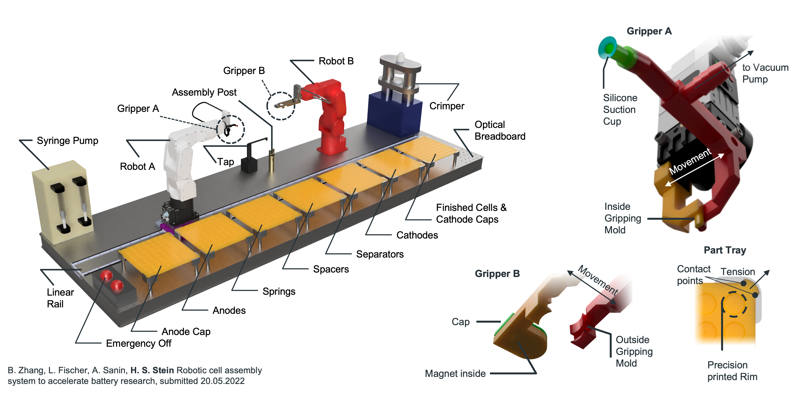

# :battery: + :robot: + :factory: = AutoBASS 
AutoBASS deploys Automated Battery Assembly System. The motivation of this project is to meet the need of scaling-up and accuate assembly of in-house i.e. non-commercially acquired cells in battery reaserach, therefore enables the data-driven studies on optimization of active materials, electrolyte formulations, processing and manufacturing in a reproducible manner for the investigation of new chemistries.



## What are you here for?

I'm here for:
### Data
Please go to the data folder of this repo. There you will find four zip files which you need to download and unzip:
1. cell_data_published.pck 2.zip.001
2. cell_data_published.pck 2.zip.002
3. cell_data_published.pck 2.zip.003
4. cell_data_published.pck 2.zip.004

The problem is that github only allows binary files of 25 mb size so unzip them somewhere and then you'll get a pickle file that you can read in in python via:

```python
import pickle
data = pickle.load(open(r'/path/to/the/file/cell_data_published.pck','rb'))
```

We did this using python 3.7 so make sure you're not using an outdated version.
Then the data variable will contain all data for all cells (failed or not) as a list of dictionaries.
For each cell we record: 
#### **raw data**
Keys: I, V, t, index, Discharge_Capacity<br/>
Essentially what the arbin spits out. Index is the cycle index. The Discharge_Capacity is this strange Arbin thing which we keep in
#### **semi processed data**
Keys: ocv_assembly, channel, start_time, closing_time, dayli_id, Vsm<br/>
We write down that potential of the first few seconds, which channel was used, when the cycling started, when the cell was closed, some id to track cells internally and a smoothed voltage profile
#### **Cell images**
Keys: anode_image, separator_image, cathode_image<br/>
Relatively self explanatory by name. If there is no image the camera faulted
#### **Derived data**
Keys: dQdV, Q <br/>
This is data we calculate

#### Example Data access:

Ok let's say we want to see the voltage profile of cell 42 the we do this:

```python
import pickle
data = pickle.load(open(r'/path/to/the/file/cell_data_published.pck','rb'))

plt.plot(data[42]['t'],data[42]['V'])
plt.xlabel('Time [s]')
plt.ylabel('Voltage [V]')
```

If you look at the dQ/dV data make sure to scale the plots right as there is still considerable noide in the data. We recooment to plot vs. the smoother Voltage profile which is in the Vsm key.

### Building my own
Have a look at the stl files in the mechanical parts folder.
You will need
1. A Crimper
2. 2x Mecademic Meca 500 r.3
3. 2x Meca compatible Schunk Grippers
4. Jenny Science Linax Linear rail
5. Optical table
6. A 3D printer
7. Possibly our help
8. A very large glovebox

Please reach out to us if you are planning to set one up in your lab as there are some practical issues to be considered like the Athmosphere of your glovebox. We recommend to not use Argon as robots can fail very fast due to overheating issues. The GUI Bojing wrote makes a lot of the aligning tasks a lot easier (you will need this too).

Consider getting a glovebox with forced laminar flow as otherwise there can be issues of trapped gases.

The crimper is typically quite heavy and does not need to be fixed additonally. Overall you "just" need to assemble all parts and teach the robot the positions. We taught the robot ALL prositions manually.


### Lurking
Have a look at the data or code then? Or read the paper which ist published at [JOURNAL]


## Motivation
In battery research, manual coin cell assembly is still the most widely used methode to manufacture the in-house cells for testing, but the precise placement of electrodes and timing of electrolyte injection are challenging for researchers who manually perform the assembly inside of a glovebox. The small variations in manufacturing processe strongly impacts the intrinsic variability the overall system performance such as capacity, resistance and degradation rate between cells, which is a crucial issue that needs to be addressed while performing the data-driven stuides, therefore, we see it35 a pressing need to automate the assembly process, enabling the manufacturing of larger numbers of cells in a reproducible manner for the investigation of new chemistries. We, therefore, build the automatic battery assembly system (AutoBASS) which is capable of assmeblying up to 64 coin cells in a batch, the main parts of AutoBASS consist of two 6-axis robotic arms (Mecademic meca500 rev.2), a linear rail (Jenny Science Linax LXS 1800), and a programmable syring pump, providing a accuracy of placement in 0.2mm and that of electrolyte despersing in 1nL. The assembly procedure is accroding to the standard assembly procedure of Coin Cell 2032 recommonded by BIG-MAP. A graphic user interface is specificly designed for proper operating of the system. Image of electrodes upon placement and real-time record of events during operating of the system were created to help keep track of the variablilty of the cells.

## Design
In principle, the assembly procedure in AutoBASS consists of three major steps i.e. placing of conponents, injection of electrolyte, and crimping of cell, which are executed by sequentially calling actions of corresponding devices. The major devieces are two 6-axis robotic arms (assemblying and transporting robots) and one linear rail. In step placing, the assemblying robot mounted on the linear rail need to work coorperatively due to the limitaion of the robot's working area i.e. the relocation of assemblying robot in x-axis will be acomplished by the linear rail, whereas changes of tool's position in y-axis will be conducted by the assembly robot. Positions of each pits on the tray are identified with numbers from 1 to 64, associated with the components' names and specific positions and saved in a json file, which will be recalled while implementing the pick-up sequence. The injection of electrolyte is executed by calling the action of the syring pump (Halmiton Microlab 600) and a step-motor-controlled rotating electrolyte tap connect to it. Images will be taken upon the placement of anode and separator using a HD camera atached to the assemblying robot.In the crimping step, the transporting robot is used first transfering the closed cell intto the pressure adjustable electric crimper (MTI MSK-160E) which will be then triggered by a mictrocontroller relay connected to it. The sealed cell will be then grapped from the crimping die and placed agian on the assembly post through a magnetic mold mounted on the transporting robot. The finished cell will be eventally transfered to the vacant position of the tray holding cathode cups.

## Structure
For each individual devices, corresponding script is implemented responsible for controlling i.e. performing the required actions at specific time for example Robots.py is responsible for all actions which will be implemented by the assemblying and transfering robots. The complete automatic assembly procedure is organized by Assembly.py. Robot_test_UI.py can be directly launched and is responsible for calibration of each positions associated with the accuracy of placing components. And if you need an easy approach to make cells, launching Autobass.py is highly recommened.

## Enviroment setup
AutoBASS is very easy-to-read and user-friendly,  besides hardware drivers you just need a working python 3.7 installation and the drivers for the corresponding hardware as well. If you are using mecademic robots you need to install their (awesome!) python driver too.

## Launch script
AutoBaSS.py script can automatically guide you through the procedure from scratch:
    Launch 'AutoBass.py'
    Click "Assembly Coin Cell"
    Click "Initialize system" and wait for the progress bar to finish
    Type in the position of cell you want to start and to finish in numbers (No.1 refers to the cell on the up-left corner, No.64 refers to the one on the down-right corner)
    Click "Start Assembly" and the procedure will start
